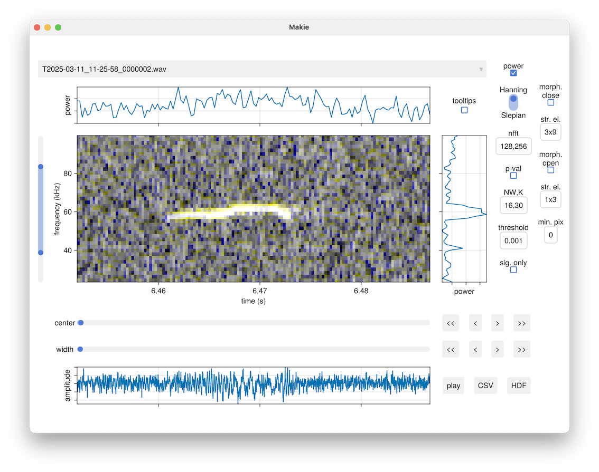

# Acoustic Segmenter (Ax2)

Given an audio recording, find tones that are significantly above background
noise.  Multi-taper harmonic analysis is used to identify time-frequency pixels
containing signal and machine vision techniques are used to turn adjacent
pixels into contours.  Output are bounding boxes consisting of start and stop
times, and low and high frequencies.  Designed for behaving animals but should
generalize.

This package builds upon its predecessor
[Ax](https://github.com/JaneliaSciComp/Ax) by adding a GUI to more easily
adjust the hyperparameters.  Analysis of recordings can also be done
interactively, or scripted as before.

# Installation

At some point binary executables might be offered in the releases page of the
github website.  Until then you'll need to run Ax2 on the Julia command
line.  

Install Julia with [juliup](https://github.com/JuliaLang/juliaup) and then in Julia:

```julia
]add https://github.com/JaneliaSciComp/Ax2
using Pkg;  Pkg.activate(dirname(dirname(pathof(Ax2))))
]add add https://github.com/bjarthur/DSP.jl#bja/ftest
```

Note that Ax2 currently relies on a [pull
request](https://github.com/JuliaDSP/DSP.jl/pull/633) submitted to DSP.jl.

# Basic Usage

## Interactive

Start Ax2 by opening Julia (with the `-t auto` option to use threads) and then
executing:

```julia
using Ax2, GLMakie
app(<path-to-a-folder-of-WAV-files>)
```

A window similar to the following will appear:



Click on the "tooltips" checkbox and then hover over any widget to see a popup
window describing what it does.

Briefly, Ax2 will take up to three fast Fourier transforms (FFT) using Hanning
windows of different lengths (nfft textbox) and overlay them in the red, green,
and blue color channels of the displayed image (power checkbox).  It will also
similarly compute another set of FFTs using K Slepian windows (NW,K textbox)
for each window length (F-test checkbox) and compare the average of the
predicted mean at each time-frequency pixel to it's variance (p-val textbox).
Significant pixels are shown in fuchsia.  Small gaps between these pixels can
be filled in (morph. open checkbox) using a structuring element of your
choosing (str. el. textbox).  Random isolated pixels can be culled with either
morophological opening (morph. open checkbox) or by setting a minimum number of
pixels each connected component must have (min. pix textbox).  Bounding boxes
of vocalizations in the currently displayed image can be saved to either
a CSV or HDF file.

## Script

To programmatically analyze a batch of files, create a .jl file with the
following contents:

```
using Ax2

nffts = [128,256]
nw, k = 16, 30
pval = 0.001
sigonly = true
morphclose = true
strelclose = make_strel((3,9))
morphopen = false
strelopen = nothing
minpix = 10

y, fs = load_recording(<path-to-WAV-file>)
Ys = calculate_hanning_spectrograms(y, nffts, fs)
configs = precompute_configs(nffts, nw, k, fs)
iclip = (1, length(y))
mtspectrums = calculate_multitaper_spectrograms(vec(y), nffts, configs, iclip)
Fs = coalesce_multitaper_ftest(mtspectrums)
F = refine_ftest(Fs, pval, sigonly, morphclose, strelclose, morphopen, strelopen, minpix)
Y_freq = freq(Ys[argmax(nffts)])
Y_time = time(Ys[argmin(nffts)])
ifreq, itime = 1:length(Y_freq), 1:length(Y_time)
save_csv(<path-to-CSV-file>, F, Y_freq, ifreq, Y_time, itime)
```

After executing it, the contents of the CSV file will be something like the
following:

```
start (sec),stop (sec),low (Hz),high (Hz)
0.2048,0.207872,3906.25,3906.25
0.36736,0.369664,3906.25,3906.25
0.37888,0.38144,3906.25,5859.375
0.483328,0.485888,2929.6875,3906.25
```

# Author

Ben Arthur, arthurb@hhmi.org  
[Scientific Computing](https://www.janelia.org/support-team/scientific-computing-software)  
[Janelia Farm Research Campus](http://www.janelia.org)  
[Howard Hughes Medical Institute](http://www.hhmi.org)
